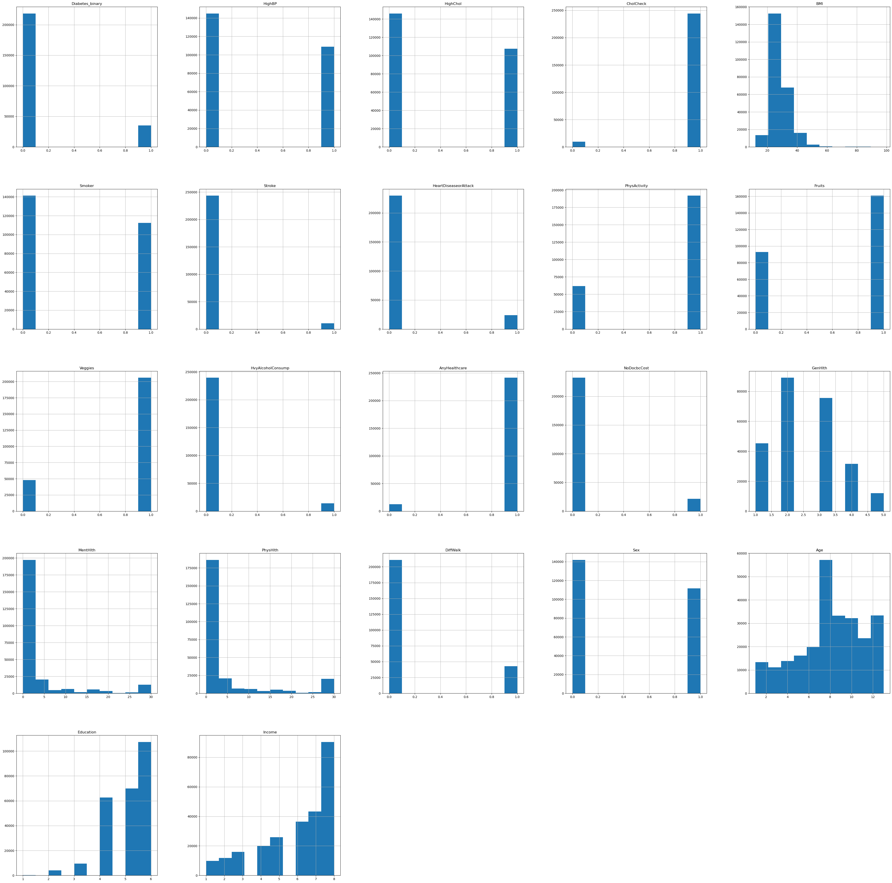
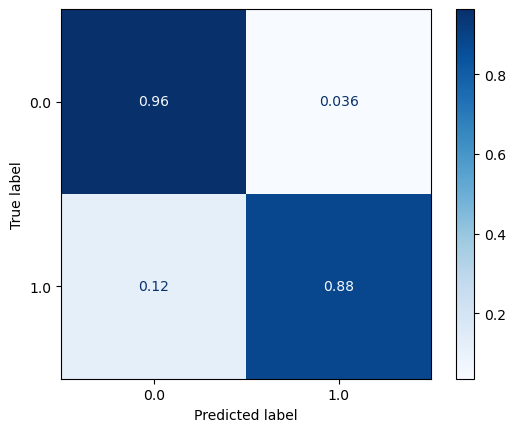
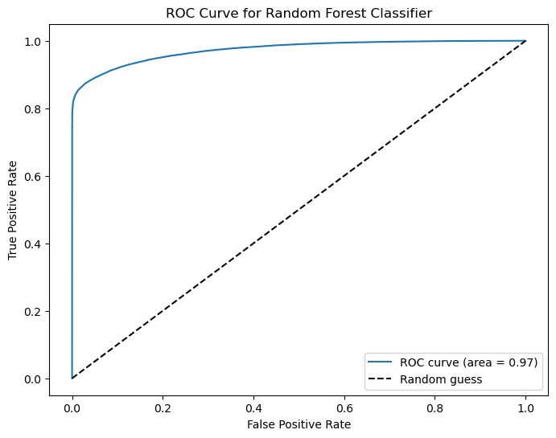
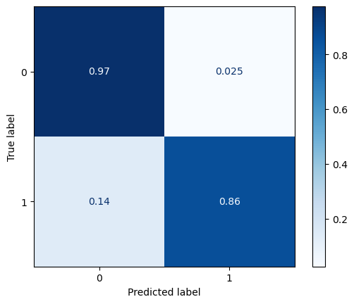
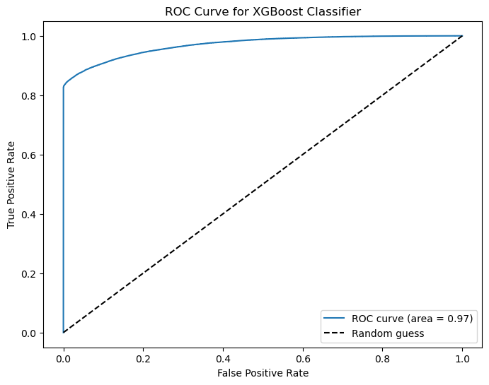
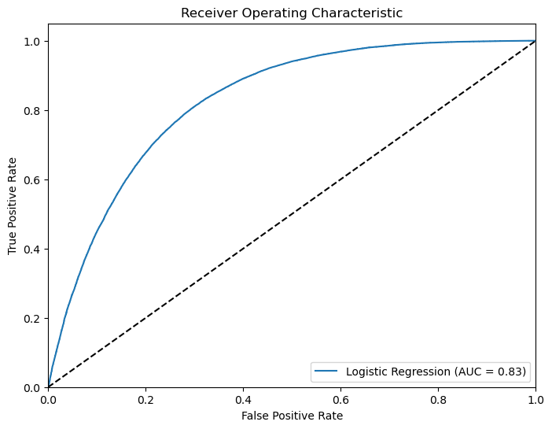
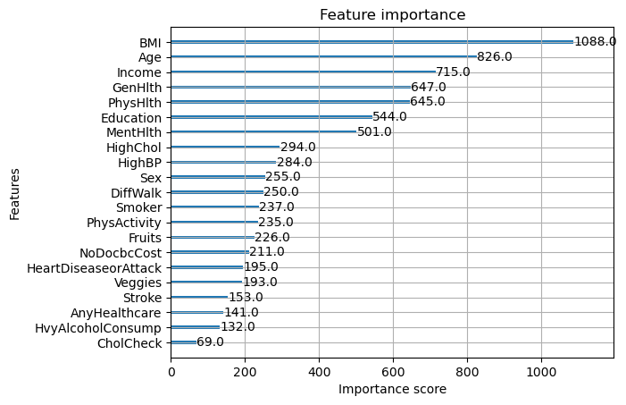

### **Predicting Dieabetes from survey data with ML classifiers**

This notebook willexplore the use of ML models to predict diabates. I will use a dataset from the Diabetes Health Indicators Dataset at Kaggle provided by Alex Teboul.    
Dataset file: `diabetes_binary_health_indicators_BRFSS2015.csv` from the *Diabetes Health Indicators Dataset* by Alex Teboul.  It is based on the The Behavioral Risk Factor Surveillance System (BRFSS), which is a health-related telephone survey that is collected annually by the CDC. 

---

## Business Understanding

The business goal is to **predict the risk of diabetes** using survey data and identify which dataset factors explain diabetes risk.  
I performed EDA to understand the data, built initial baseline models with two ML classifiers (i.e. logistic regression and RandomForest). Then I explored additional ML algorithms to find one that does the best job of predicting which patients are likely to have diabetes.
---

## Data Understanding and EDA

In this section, I explored the dataset to assess:

- **Data Types**  
  Number of variables, their types (numeric/categorical)

- **Data Quality**  
  Missing values, variables with just a single value across all rows

- **Correlations**  
  Which variables are correlated with each other or with outcome

- **Data Distributions**  
  Distribution shape and skewness of variables

- **Outliers**  
  Detection and handling of outliers

**Key Insights from EDA:**

1. The dataset has class imbalance: only **13.9%** of respondents had diabetes.
2. **BMI** variable is heavily right-skewed; 65% of respondents have BMI below 29.
3. **Stroke** variable is right-skewed; 96% of respondents had no stroke.
4. 95% and 92% of respondents report **health coverage** and **access to a doctor respectively**.

5. Moderate/high correlations observed, e.g. **GenHlth vs PhysHlth (0.46)**, **GenHlth vs DiffWalk (0.53)**, **PhysHlth vs DiffWalk (0.48)**.

---

## Baseline Classifier Models

Models trained on cleansed dataset:

| Model               | F1 Score | Precision | Recall   | AUC      | Accuracy |
|---------------------|----------|-----------|----------|----------|----------|
| **Random Forest**   | 0.223    | 0.580     | 0.138    | 0.826    | 0.867    |
| **Logistic Reg.**   | 0.253    | 0.547     | 0.164    | 0.826    | 0.866    |

*Both Random Forest and Logistic regression had low F1 score, precision and recall due to class imbalance.  
Accuracy was ignored due to class imbalance.*

---

## Resolving class imbalance
I used the SMOTE algorithm to resolve the class imbalance in the dataset reported above. After applying SMOTE the dataset was balanced with a 50/50 split between diabetic and non-diabetic patients. 

## MODELING
After balancing the dataset with the SMOTE algorithm, the data was split into training (80%) and test sets (20%). Numerical variables were rescaled with the StandardScaler, while categorical variables were encoded with the OneHotEncoder.

Three binary classifier algorithms were built to predict diabates from the balanced dataset. Gridsearch with 5-fold cross-validation was used to find the best model for each algorithm. The results are shown in the following table:

| **Model**                | **F1 Score** | **Precision** | **Recall** | **AUC** | **Accuracy** |
|--------------------------|--------------|--------------|------------|---------|--------------|
| **Random Forest**        | 0.92         | 0.96         | 0.88       | 0.97    | 0.92         |
| **XGBoost**              | 0.91         | 0.97         | 0.86       | 0.97    | 0.92         |
| **Logistic Regression**  | 0.76         | 0.74         | 0.78       | 0.83    | 0.75         |

## Random Forest Model
Here's the results of the RandomForest model derived from a GridSearch with 5-fold cross-validation.  As shown in the below table, all performance metrics (F1 score, precision, recall and AUC) increased by at least 6% after balancing the dataset with SMOTE.  

| Metric     | Before SMOTE | After SMOTE | % Increase |
|-------------|---------------|-------------|-------------|
| F1 Score    | 0.223         | 0.92        | 312%        |
| Precision   | 0.580         | 0.96        | 66%         |
| Recall      | 0.138         | 0.88        | 538%        |
| AUC         | 0.826         | 0.97        | 17%         |
| Accuracy    | 0.867         | 0.92        | 6%          |
   
Here's the confusion matrix and ROC curve of the model after SMOTE:

## XGBoost Model

Here's the results of the XGBoost model trained with GridSearch and five-fold cross-validation after applying SMOTE to the dataset.
| **F1 Score** | **Precision** | **Recall** | **AUC** | **Accuracy** |
|---------------|---------------|------------|----------|---------------|
| 0.91          | 0.97          | 0.86       | 0.97     | 0.92          |

Here's the confusion matrix and ROC curve for the XGBoost model:

## Logistic Regression

Applying the SMOTE algorithm boosted the performance of the baseline Logistic regression model by at least 376% as shown in this table.  
| Metric     | Before SMOTE | After SMOTE | % Increase |
|------------|--------------|-------------|------------|
| F1 Score   | 0.253        | 0.76        | 201%       |
| Precision  | 0.547        | 0.74        | 35%        |
| Recall     | 0.164        | 0.78        | 376%       |
| AUC        | 0.826        | 0.83        | 0%         |
| Accuracy   | 0.866        | 0.75        | -13%       |

Here's the AUC curve after applying SMOTE:

## Most Important Drivers of Response

The best XGBoost model identified the top drivers of response:

---

### Variables Ranked by Importance (One-per-Line)
The top 5 variables are as follows:

1. BMI
2. Age
3. Income
4. GenHlth and
5. PhysHlth

