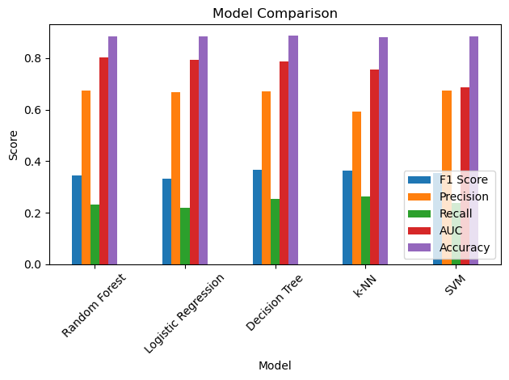

### **Comparing the performance of different ML classifiers** 

This notebook will compare the performance of different ML classifiers (e.g. k-nearest neighbors, logistic regression, decision trees, and support vector machines). We will use the Bank marketing dataset provided from the UC Irvine Machine Learning Repository.  

# **Business understanding**

The business goal is to find a model that can explain success of a contact, i.e. if the client subscribes the deposit. Using the Bank marketing dataset, I will do some analysis to determine which factors drive the success of a marketing campaign. I will perform exploratory data analysis and build Machine Learning models to find the key drivers of a marketing campaign. I will also build multiple models with different ML classifiers (e.g. k-nearest neighbors, logistic regression, decision trees, and support vector machines) to find the best one for this task.

# **Data Understanding**

In this section I explored the vehicles dataset to understand the following aspects:

* **Data types:** how many variables are there? What data types? Are there only numeric variables or also categorigal ones?  
* **data quality:** How many missing values are there? How many variables have a single value for all rows?
*  **Correlations:** Which variables are correlated with each other or with price?
* **Data distributions:** What is the distribution of the variables? Which of them are skewed?
* **Outliers:** Are there aany outliers in the dataset? If so, how do we handle them?

1. The dataset has class imabalance: only 12.7% of clients subscribed to term deposits

2. The data is skewed right: majority of customers are 40 years or below. 

3. The contacts variable is also heavily skewed right: majority of customers had under 10 contacts

4. Many of the economic indicators are highly correlated e.g. emp.var.rate is highly correlated with cons.price.idx (0.77), euribor3m (0.97) and nr.employed (0.9)

5. Cons.price.idx is also highly correlated with euribor3m (0.67) and nr.employed (0.49)

6. Euribor3m is also highly correlated with nr.employed (0.94)

# Comparing different classifiier models

The following classifier models were built with the cleansed dataset:
1. Logistic Regression
2. K-Nearest Neighbors
3. Decison Trees
4. Random Forest
5. Support Vector Machines

Of the five models, the RandomForest was the best with the highest AUC and F1 score.  I ignore accuracy due to class imbalance. The below table summarizes the performance of these models:
# plot the histogram of the age of the client
                **Model F1 Score Precision    Recall       AUC  Accuracy
3        Random Forest  0.343662   0.675277  0.230479  0.804651  0.885372
0  Logistic Regression  0.331439   0.667939  0.220403  0.795218  0.884224
2        Decision Tree  0.366300   0.671141  0.251889  0.787826  0.886520
1                 k-NN  0.364429   0.592068  0.263224  0.756517  0.880453
4                  SVM  0.353160   0.673759  0.239295  0.687863  0.885864

# Most important drivers of response

The best RandomForest model I built shows the 4 most important drivers of response are nr.employed, pdays, euribor3m and emp.var.rate.  Here's the list of variables ranked by their importance: 

                  **Importance
nr.employed       0.004296
pdays             0.003116
euribor3m         0.003017
emp.var.rate      0.002952
contact           0.002394
poutcome          0.002296
education         0.001574
month             0.001148
cons.price.idx    0.000918
day_of_week       0.000787
campaign          0.000754
cons.conf.idx     0.000623
age               0.000623
loan              0.000328
job               0.000164
default           0.000000
previous         -0.000197
housing          -0.000558
marital          -0.000623

More details are in this Jupyter Notebook. 